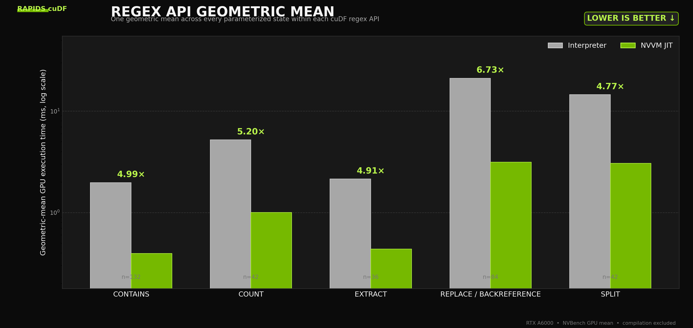

# cuDF regex API geometric means

[Vector graph](api_geomean.svg)

The graph uses one geometric mean across every parameterized state within each
cuDF regex API. Lower GPU execution time is better. The green annotation over
each pair is `interpreter time / JIT time`.

Compilation is excluded. The values are warm `nv/cold/time/gpu/mean` NVBench
measurements of the complete operation inside `state.exec`, not isolated
matcher-kernel timings.

| API | Paired states | Interpreter | NVVM JIT | Speedup |
|:---|---:|---:|---:|---:|
| contains | 132 | 1.977 ms | 0.396 ms | 4.99x |
| count | 42 | 5.221 ms | 1.005 ms | 5.20x |
| extract | 36 | 2.146 ms | 0.437 ms | 4.91x |
| replace/backreference | 84 | 21.157 ms | 3.141 ms | 6.73x |
| split | 42 | 14.605 ms | 3.060 ms | 4.77x |

Machine-readable values are in [summary.csv](summary.csv). The reproducible
renderer is [plot_api_geomean.py](plot_api_geomean.py).

Hardware: NVIDIA RTX A6000. The selected benchmark GPU was idle. CUDA exposed
it as device 0. The dark charcoal, neutral gray, and `#76B900` green palette is
presentation styling only.
